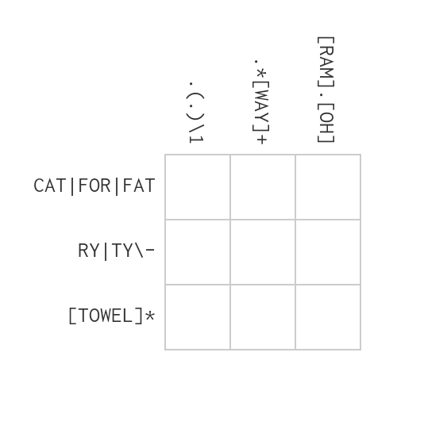

# hackingTools

## Programation

### Réseau

## Cryptographie 

- https://gchq.github.io/CyberChef/ 
- https://www.boxentriq.com/code-breaking

## Steganography

- http://www.jjtc.com/Steganography/tools.html (liste application Stenography)
- https://incoherency.co.uk/image-steganography/#unhide (bruit image)

- https://magiceye.ecksdee.co.uk/

## Forensics

### Photo
- http://fotoforensics.com/

## Misc

### Language : 

- https://esolangs.org/wiki/Esoteric_programming_language

### JavaScript

- https://lelinhtinh.github.io/de4js/ (nettoyage code)

### Apk 

- https://www.sisik.eu/apk-dump (decompile Android app code into human readable)

### Transformation 

- https://codepen.io/abdhass/full/jdRNdj (hex2Image)

### IDE

- http://vii5ard.github.io/whitespace/ (WhiteSpace avec assambleur)
- https://www.jdoodle.com/execute-whitespace-online/ (whiteSpace)
- https://onlinedisassembler.com/static/home/index.html (IDE desassembleur)

### Solver 

- https://github.com/blukat29/regex-crossword-solver (regex-crossword-solver)

### Finder 
- https://tineye.com/ (image finder)
- https://file.org/ (extension finder)
- https://archive.org/ (old web page finder)

