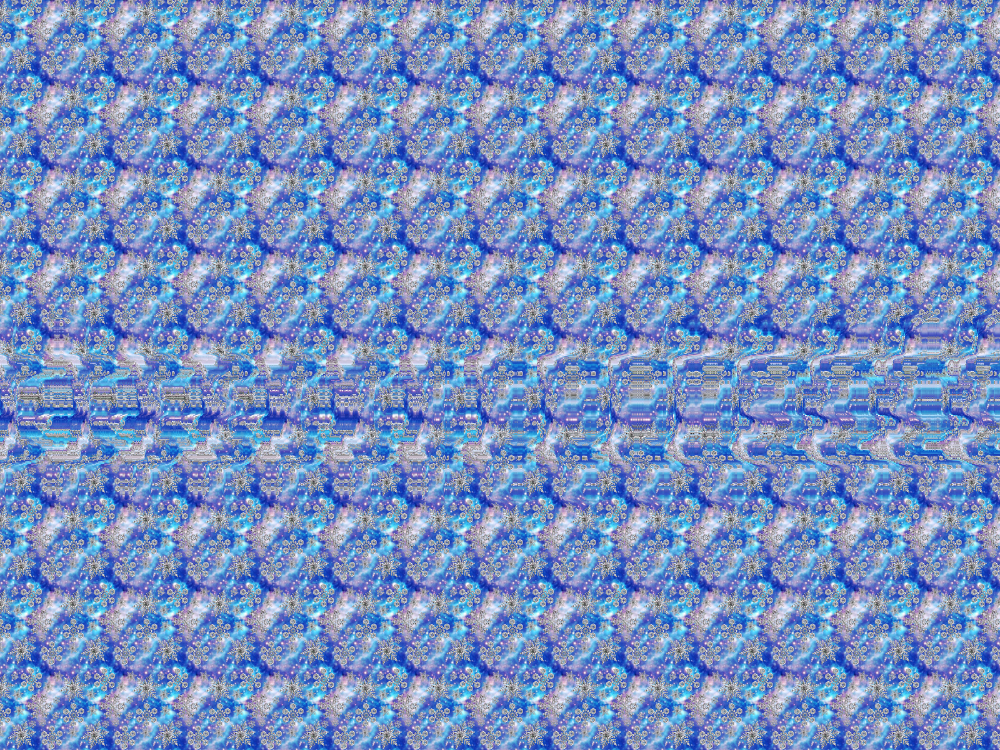

# hackingTools

## Programation

### Réseau

## Cryptographie 

- https://gchq.github.io/CyberChef/ 
- 

## Steganography

- https://incoherency.co.uk/image-steganography/#unhide (bruit image)

- https://magiceye.ecksdee.co.uk/

## Forensics

### Photo
- http://fotoforensics.com/

## Misc

### JavaScript

- https://lelinhtinh.github.io/de4js/ (nettoyage code)

### Apk 

- https://www.sisik.eu/apk-dump (decompile Android app code into human readable)
